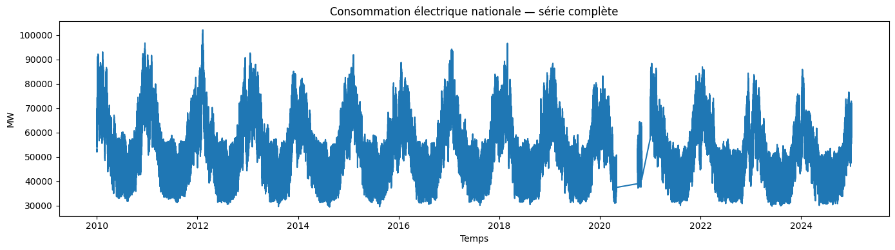
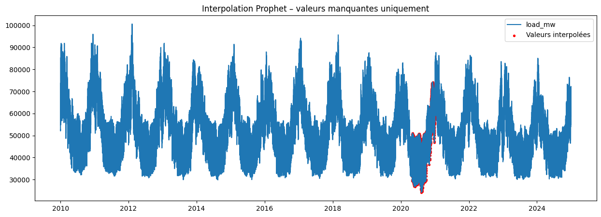
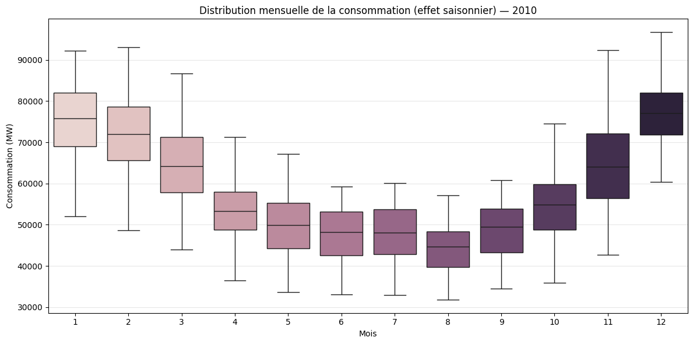
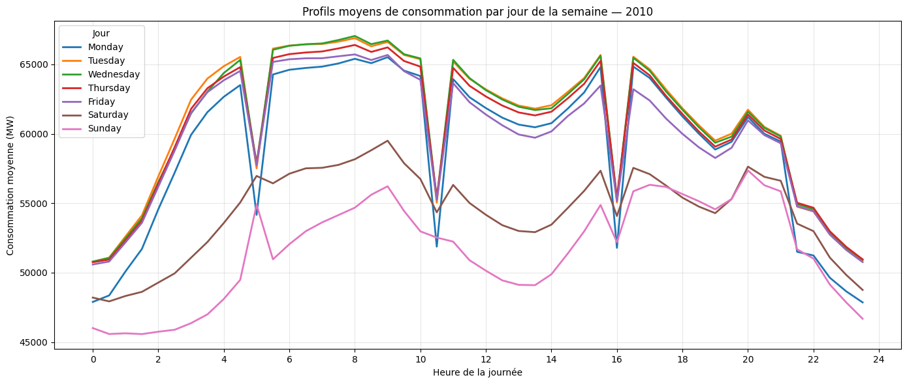
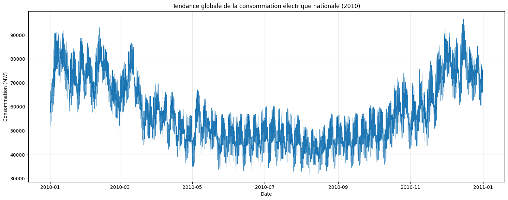
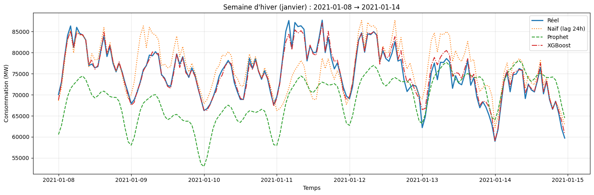
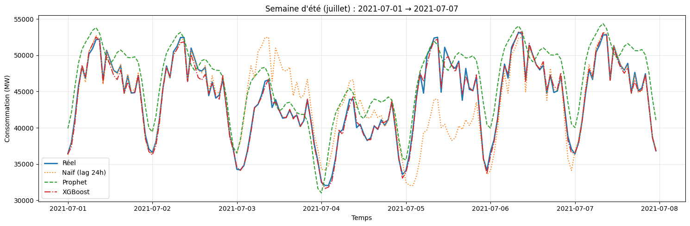

# Sommaire

- [1. Exploration des données](#section-01-exploration)
- [2. Nettoyage des données](#section-02-cleaning)
- [3. Feature Engineering](#section-03-feature-engineering)
- [4. Feature Engineering – Prophet](#section-04-feature-engineering-prophet)
- [5. Modélisation](#section-05-modeling)
- [6. Analyse des résultats](#section-06-analysis)


<a id="section-01-exploration"></a>

# 1. Exploration des données

*Transition et contexte de la section suivante.*

# 01 — Exploration des données
Ce notebook sert à **comprendre la structure** des données (plage temporelle, continuité horaire, valeurs manquantes).

**Entrées attendues** (générées par le pipeline) :
- `data/processed/consommation_clean.parquet`
- (optionnel) `data/processed/weather_national_hourly.parquet`


```python
import os


if os.getcwd().endswith("notebooks"):
    os.chdir("..")

print(f"Current Working Directory: {os.getcwd()}")

```

    Current Working Directory: /home/onyxia/france-grid-stress-prediction


```python
from pathlib import Path
import pandas as pd
import matplotlib.pyplot as plt

PROJECT_ROOT = Path('.').resolve() 
DATA_PROCESSED = PROJECT_ROOT / 'data' / 'processed'
OUTPUT_FIG = PROJECT_ROOT / 'outputs' / 'figures'
OUTPUT_FIG.mkdir(parents=True, exist_ok=True)

CONS_PATH = DATA_PROCESSED / 'consommation_clean.parquet'
WEATHER_PATH = DATA_PROCESSED / 'weather_national_hourly.parquet'

CONS_PATH.exists(), WEATHER_PATH.exists()


```


    (True, True)


## 1) Chargement


```python
df_load = pd.read_parquet(CONS_PATH)
df_load['datetime'] = pd.to_datetime(df_load['datetime'])
df_load = df_load.sort_values('datetime').reset_index(drop=True)
df_load.head()
```


<div>
<style scoped>
    .dataframe tbody tr th:only-of-type {
        vertical-align: middle;
    }

    .dataframe tbody tr th {
        vertical-align: top;
    }

    .dataframe thead th {
        text-align: right;
    }
</style>
<table border="1" class="dataframe">
  <thead>
    <tr style="text-align: right;">
      <th></th>
      <th>datetime</th>
      <th>load_mw</th>
    </tr>
  </thead>
  <tbody>
    <tr>
      <th>0</th>
      <td>2010-01-01 00:00:00</td>
      <td>53067</td>
    </tr>
    <tr>
      <th>1</th>
      <td>2010-01-01 00:30:00</td>
      <td>52303</td>
    </tr>
    <tr>
      <th>2</th>
      <td>2010-01-01 01:00:00</td>
      <td>52272</td>
    </tr>
    <tr>
      <th>3</th>
      <td>2010-01-01 01:30:00</td>
      <td>52013</td>
    </tr>
    <tr>
      <th>4</th>
      <td>2010-01-01 02:00:00</td>
      <td>52099</td>
    </tr>
  </tbody>
</table>
</div>


```python
df_load.info()
```

    <class 'pandas.core.frame.DataFrame'>
    RangeIndex: 252672 entries, 0 to 252671
    Data columns (total 2 columns):
     #   Column    Non-Null Count   Dtype         
    ---  ------    --------------   -----         
     0   datetime  252672 non-null  datetime64[ns]
     1   load_mw   252672 non-null  int64         
    dtypes: datetime64[ns](1), int64(1)
    memory usage: 3.9 MB


```python
df_load[['datetime','load_mw']].describe(include='all')
```


<div>
<style scoped>
    .dataframe tbody tr th:only-of-type {
        vertical-align: middle;
    }

    .dataframe tbody tr th {
        vertical-align: top;
    }

    .dataframe thead th {
        text-align: right;
    }
</style>
<table border="1" class="dataframe">
  <thead>
    <tr style="text-align: right;">
      <th></th>
      <th>datetime</th>
      <th>load_mw</th>
    </tr>
  </thead>
  <tbody>
    <tr>
      <th>count</th>
      <td>252672</td>
      <td>252672.000000</td>
    </tr>
    <tr>
      <th>mean</th>
      <td>2017-05-16 12:56:56.717326080</td>
      <td>53819.752050</td>
    </tr>
    <tr>
      <th>min</th>
      <td>2010-01-01 00:00:00</td>
      <td>29477.000000</td>
    </tr>
    <tr>
      <th>25%</th>
      <td>2013-08-08 23:52:30</td>
      <td>44733.000000</td>
    </tr>
    <tr>
      <th>50%</th>
      <td>2017-03-16 23:45:00</td>
      <td>52011.000000</td>
    </tr>
    <tr>
      <th>75%</th>
      <td>2021-05-25 23:37:30</td>
      <td>61838.000000</td>
    </tr>
    <tr>
      <th>max</th>
      <td>2024-12-31 23:30:00</td>
      <td>102098.000000</td>
    </tr>
    <tr>
      <th>std</th>
      <td>NaN</td>
      <td>12013.888407</td>
    </tr>
  </tbody>
</table>
</div>


## 2) Couverture temporelle et continuité


```python
start, end = df_load['datetime'].min(), df_load['datetime'].max()
freq_counts = df_load['datetime'].diff().value_counts().head(10)
start, end, freq_counts
```


    (Timestamp('2010-01-01 00:00:00'),
     Timestamp('2024-12-31 23:30:00'),
     datetime
     0 days 00:30:00      252669
     154 days 00:30:00         1
     61 days 00:30:00          1
     Name: count, dtype: int64)


```python
# Vérification des gaps horaires (attendu: 1H)
gaps = df_load['datetime'].diff().dropna()
largest_gaps = gaps.sort_values(ascending=False).head(20)
largest_gaps
```


    181104   154 days 00:30:00
    182544    61 days 00:30:00
    1          0 days 00:30:00
    168451     0 days 00:30:00
    168450     0 days 00:30:00
    168449     0 days 00:30:00
    168448     0 days 00:30:00
    168447     0 days 00:30:00
    168446     0 days 00:30:00
    168453     0 days 00:30:00
    168445     0 days 00:30:00
    168444     0 days 00:30:00
    168443     0 days 00:30:00
    168442     0 days 00:30:00
    168441     0 days 00:30:00
    168440     0 days 00:30:00
    168452     0 days 00:30:00
    168454     0 days 00:30:00
    168438     0 days 00:30:00
    168455     0 days 00:30:00
    Name: datetime, dtype: timedelta64[ns]


```python
# Nombre de valeurs manquantes sur la cible
df_load['load_mw'].isna().sum()
```


    np.int64(0)


## 3) Visualisations rapides


```python
plt.figure(figsize=(14,4))
plt.plot(df_load['datetime'], df_load['load_mw'])
plt.title('Consommation électrique nationale — série complète')
plt.xlabel('Temps')
plt.ylabel('MW')
plt.tight_layout()
plt.savefig(OUTPUT_FIG / 'load_timeseries_full.png', dpi=150)
plt.show()
```


    

    


## 4) Météo agrégée (optionnel)


```python
if WEATHER_PATH.exists():
    df_w = pd.read_parquet(WEATHER_PATH)
    if 'datetime' in df_w.columns:
        df_w['datetime'] = pd.to_datetime(df_w['datetime'])
    df_w = df_w.sort_values('datetime').reset_index(drop=True)
    display(df_w.head())
    display(df_w.info())
else:
    print('weather_national_hourly.parquet absent — section ignorée.')
```


<div>
<style scoped>
    .dataframe tbody tr th:only-of-type {
        vertical-align: middle;
    }

    .dataframe tbody tr th {
        vertical-align: top;
    }

    .dataframe thead th {
        text-align: right;
    }
</style>
<table border="1" class="dataframe">
  <thead>
    <tr style="text-align: right;">
      <th></th>
      <th>datetime</th>
      <th>temperature_2m</th>
      <th>wind_speed_10m</th>
      <th>direct_radiation</th>
      <th>diffuse_radiation</th>
      <th>cloud_cover</th>
    </tr>
  </thead>
  <tbody>
    <tr>
      <th>0</th>
      <td>2010-01-01 00:00:00</td>
      <td>4.273719</td>
      <td>12.397994</td>
      <td>0.0</td>
      <td>0.0</td>
      <td>93.96875</td>
    </tr>
    <tr>
      <th>1</th>
      <td>2010-01-01 01:00:00</td>
      <td>4.036219</td>
      <td>12.709288</td>
      <td>0.0</td>
      <td>0.0</td>
      <td>95.40625</td>
    </tr>
    <tr>
      <th>2</th>
      <td>2010-01-01 02:00:00</td>
      <td>3.812781</td>
      <td>13.122019</td>
      <td>0.0</td>
      <td>0.0</td>
      <td>96.46875</td>
    </tr>
    <tr>
      <th>3</th>
      <td>2010-01-01 03:00:00</td>
      <td>3.598719</td>
      <td>13.308270</td>
      <td>0.0</td>
      <td>0.0</td>
      <td>96.87500</td>
    </tr>
    <tr>
      <th>4</th>
      <td>2010-01-01 04:00:00</td>
      <td>3.426844</td>
      <td>14.081800</td>
      <td>0.0</td>
      <td>0.0</td>
      <td>94.78125</td>
    </tr>
  </tbody>
</table>
</div>


    <class 'pandas.core.frame.DataFrame'>
    RangeIndex: 131496 entries, 0 to 131495
    Data columns (total 6 columns):
     #   Column             Non-Null Count   Dtype         
    ---  ------             --------------   -----         
     0   datetime           131496 non-null  datetime64[ns]
     1   temperature_2m     131496 non-null  float64       
     2   wind_speed_10m     131496 non-null  float64       
     3   direct_radiation   131496 non-null  float64       
     4   diffuse_radiation  131496 non-null  float64       
     5   cloud_cover        131496 non-null  float64       
    dtypes: datetime64[ns](1), float64(5)
    memory usage: 6.0 MB


    None


<a id="section-02-cleaning"></a>

# 2. Nettoyage des données

*Transition et contexte de la section suivante.*

# 02 — Nettoyage & préparation des données (consommation + météo)

Ce notebook prépare les **datasets propres** utilisés dans la suite du projet *Stress Grid* :

1. **Consommation nationale** : consolidation des fichiers `consommation_YYYY_long.csv` (pas 30 min) → `consommation_clean.parquet`
2. **Météo multi-villes** : nettoyage + contrôle de continuité horaire → agrégation nationale → `weather_national_hourly.parquet`
3. **Alignement temporel** : consommation (resample horaire) + météo nationale (horaire) → `dataset_model_hourly.parquet`

> Remarque : le “trou” 2020 (mai→septembre) est une **absence de données source** et n’est pas imputé dans le baseline.


## 0. Imports & configuration

Le code “lourd” est déporté dans `src/data/` afin de garder ce notebook lisible (orchestration + contrôles).


```python
import os


if os.getcwd().endswith("notebooks"):
    os.chdir("..")

print(f"Current Working Directory: {os.getcwd()}")
```

    Current Working Directory: /home/onyxia/france-grid-stress-prediction


```python
import pandas as pd
import sys
from pathlib import Path


# On fixe le chemin "en dur"
PROJECT_ROOT = Path("/home/onyxia/france-grid-stress-prediction")

# Ajoute la racine du projet en priorité (avant site-packages)
if str(PROJECT_ROOT) not in sys.path:
    sys.path.insert(0, str(PROJECT_ROOT))


DATA_DIR = PROJECT_ROOT / "data"
DATA_RAW = DATA_DIR / "interim"
DATA_PROCESSED = DATA_DIR / "processed"

print("PROJECT_ROOT:", PROJECT_ROOT)
print("DATA_RAW exists:", DATA_RAW.exists())
print("DATA_PROCESSED exists:", DATA_PROCESSED.exists())


```

    PROJECT_ROOT: /home/onyxia/france-grid-stress-prediction
    DATA_RAW exists: True
    DATA_PROCESSED exists: True


```python
import sys
sys.path.append("/home/onyxia/france-grid-stress-prediction/src")

import pandas as pd
from pathlib import Path

from data.prophet_fill import fill_missing_with_prophet

import importlib, sys
from pathlib import Path

PROJECT_ROOT = Path.cwd().resolve().parent
sys.path.insert(0, str(PROJECT_ROOT))

print("Trying import src ...")
import src
print("src imported from:", src.__file__ if hasattr(src, "__file__") else src)

print("Trying import src.data ...")
import src.data
print("src.data imported from:", src.data.__file__ if hasattr(src.data, "__file__") else src.data)

```

    Trying import src ...
    src imported from: /home/onyxia/france-grid-stress-prediction/src/__init__.py
    Trying import src.data ...
    src.data imported from: /home/onyxia/france-grid-stress-prediction/src/data/__init__.py


## 1. Consommation électrique — nettoyage et consolidation

- Standardisation des colonnes (`datetime`, `load_mw`)
- Tri temporel + déduplication
- Contrôle simple de continuité (pas attendu = 30 min)
- Export en Parquet


```python
from src.data.consumption_cleaning import ConsumptionCleanConfig, build_consumption_dataset


cfg_cons = ConsumptionCleanConfig(
    raw_dir=DATA_RAW / "consommation",   
    out_path=DATA_PROCESSED / "consommation_clean.parquet",
    pattern="consommation_*_long.csv",
)

df_cons, report_cons = build_consumption_dataset(cfg_cons)


```

### 1.1 Contrôles rapides

- Bornes temporelles
- Unicité de `datetime`
- Pas de temps observé (distribution des deltas)


```python
df_cons["datetime"].min(), df_cons["datetime"].max(), len(df_cons), df_cons["datetime"].is_unique

```


    (Timestamp('2010-01-01 00:00:00'),
     Timestamp('2024-12-31 23:30:00'),
     252672,
     True)


```python
df_cons = df_cons.sort_values("datetime")
df_cons["datetime"].diff().value_counts().head(10)

```


    datetime
    0 days 00:30:00      252669
    154 days 00:30:00         1
    61 days 00:30:00          1
    Name: count, dtype: int64


## 2. Météo — nettoyage, contrôle, agrégation nationale

- Nettoyage : colonnes, datetime (UTC → naïf), doublons (`city`, `datetime`)
- Contrôle de continuité horaire **par ville**
- Agrégation nationale : moyenne horaire sur l’ensemble des villes


```python
from src.data.weather_cleaning import WeatherCleanConfig, build_weather_national_dataset
from pathlib import Path

raw_dir = Path("data/raw/weather")          # <-- adapte
out_path = Path("data/processed/weather_national_hourly.parquet")  

cfg_w = WeatherCleanConfig(raw_dir=raw_dir, out_path=out_path)

df_weather_nat, report_weather = build_weather_national_dataset(cfg_w)

display(report_weather.head(10))
df_weather_nat.head()


```


<div>
<style scoped>
    .dataframe tbody tr th:only-of-type {
        vertical-align: middle;
    }

    .dataframe tbody tr th {
        vertical-align: top;
    }

    .dataframe thead th {
        text-align: right;
    }
</style>
<table border="1" class="dataframe">
  <thead>
    <tr style="text-align: right;">
      <th></th>
      <th>city</th>
      <th>rows</th>
      <th>min_dt</th>
      <th>max_dt</th>
      <th>n_bad_steps</th>
    </tr>
  </thead>
  <tbody>
    <tr>
      <th>0</th>
      <td>Angers</td>
      <td>131496</td>
      <td>2010-01-01</td>
      <td>2024-12-31 23:00:00</td>
      <td>0</td>
    </tr>
    <tr>
      <th>1</th>
      <td>Avignon</td>
      <td>131496</td>
      <td>2010-01-01</td>
      <td>2024-12-31 23:00:00</td>
      <td>0</td>
    </tr>
    <tr>
      <th>2</th>
      <td>Bordeaux</td>
      <td>131496</td>
      <td>2010-01-01</td>
      <td>2024-12-31 23:00:00</td>
      <td>0</td>
    </tr>
    <tr>
      <th>3</th>
      <td>Brest</td>
      <td>131496</td>
      <td>2010-01-01</td>
      <td>2024-12-31 23:00:00</td>
      <td>0</td>
    </tr>
    <tr>
      <th>4</th>
      <td>Béthune</td>
      <td>131496</td>
      <td>2010-01-01</td>
      <td>2024-12-31 23:00:00</td>
      <td>0</td>
    </tr>
    <tr>
      <th>5</th>
      <td>Caen</td>
      <td>131496</td>
      <td>2010-01-01</td>
      <td>2024-12-31 23:00:00</td>
      <td>0</td>
    </tr>
    <tr>
      <th>6</th>
      <td>Clermont-Ferrand</td>
      <td>131496</td>
      <td>2010-01-01</td>
      <td>2024-12-31 23:00:00</td>
      <td>0</td>
    </tr>
    <tr>
      <th>7</th>
      <td>Dijon</td>
      <td>131496</td>
      <td>2010-01-01</td>
      <td>2024-12-31 23:00:00</td>
      <td>0</td>
    </tr>
    <tr>
      <th>8</th>
      <td>Douai - Lens</td>
      <td>131496</td>
      <td>2010-01-01</td>
      <td>2024-12-31 23:00:00</td>
      <td>0</td>
    </tr>
    <tr>
      <th>9</th>
      <td>Genève - Annemasse (partie française)</td>
      <td>131496</td>
      <td>2010-01-01</td>
      <td>2024-12-31 23:00:00</td>
      <td>0</td>
    </tr>
  </tbody>
</table>
</div>


<div>
<style scoped>
    .dataframe tbody tr th:only-of-type {
        vertical-align: middle;
    }

    .dataframe tbody tr th {
        vertical-align: top;
    }

    .dataframe thead th {
        text-align: right;
    }
</style>
<table border="1" class="dataframe">
  <thead>
    <tr style="text-align: right;">
      <th></th>
      <th>datetime</th>
      <th>temperature_2m</th>
      <th>wind_speed_10m</th>
      <th>direct_radiation</th>
      <th>diffuse_radiation</th>
      <th>cloud_cover</th>
    </tr>
  </thead>
  <tbody>
    <tr>
      <th>0</th>
      <td>2010-01-01 00:00:00</td>
      <td>4.273719</td>
      <td>12.397994</td>
      <td>0.0</td>
      <td>0.0</td>
      <td>93.96875</td>
    </tr>
    <tr>
      <th>1</th>
      <td>2010-01-01 01:00:00</td>
      <td>4.036219</td>
      <td>12.709288</td>
      <td>0.0</td>
      <td>0.0</td>
      <td>95.40625</td>
    </tr>
    <tr>
      <th>2</th>
      <td>2010-01-01 02:00:00</td>
      <td>3.812781</td>
      <td>13.122019</td>
      <td>0.0</td>
      <td>0.0</td>
      <td>96.46875</td>
    </tr>
    <tr>
      <th>3</th>
      <td>2010-01-01 03:00:00</td>
      <td>3.598719</td>
      <td>13.308270</td>
      <td>0.0</td>
      <td>0.0</td>
      <td>96.87500</td>
    </tr>
    <tr>
      <th>4</th>
      <td>2010-01-01 04:00:00</td>
      <td>3.426844</td>
      <td>14.081800</td>
      <td>0.0</td>
      <td>0.0</td>
      <td>94.78125</td>
    </tr>
  </tbody>
</table>
</div>


```python
w = pd.read_parquet(DATA_PROCESSED / "weather_national_hourly.parquet")
w["datetime"] = pd.to_datetime(w["datetime"])
print("weather years:", sorted(w["datetime"].dt.year.unique())[:5], "...", sorted(w["datetime"].dt.year.unique())[-5:])

```

    weather years: [np.int32(2010), np.int32(2011), np.int32(2012), np.int32(2013), np.int32(2014)] ... [np.int32(2020), np.int32(2021), np.int32(2022), np.int32(2023), np.int32(2024)]


## 3. Alignement temporel et fusion (baseline)

- Consommation : resample horaire (moyenne)
- Fusion sur `datetime` (inner join)
- Contrôles : doublons, continuité horaire


```python
from src.data.merge_datasets import MergeConfig, build_hourly_dataset

cfg_merge = MergeConfig(
    consumption_path=DATA_PROCESSED / "consommation_clean.parquet",
    weather_path=DATA_PROCESSED / "weather_national_hourly.parquet",
    out_path=DATA_PROCESSED / "dataset_model_hourly.parquet",
)

df_model = build_hourly_dataset(cfg_merge)
df_model.head()

```

    /home/onyxia/france-grid-stress-prediction/src/data/merge_datasets.py:25: FutureWarning: 'H' is deprecated and will be removed in a future version, please use 'h' instead.
      .resample("1H")


<div>
<style scoped>
    .dataframe tbody tr th:only-of-type {
        vertical-align: middle;
    }

    .dataframe tbody tr th {
        vertical-align: top;
    }

    .dataframe thead th {
        text-align: right;
    }
</style>
<table border="1" class="dataframe">
  <thead>
    <tr style="text-align: right;">
      <th></th>
      <th>datetime</th>
      <th>load_mw</th>
      <th>temperature_2m</th>
      <th>wind_speed_10m</th>
      <th>direct_radiation</th>
      <th>diffuse_radiation</th>
      <th>cloud_cover</th>
    </tr>
  </thead>
  <tbody>
    <tr>
      <th>0</th>
      <td>2010-01-01 00:00:00</td>
      <td>52685.0</td>
      <td>4.273719</td>
      <td>12.397994</td>
      <td>0.0</td>
      <td>0.0</td>
      <td>93.96875</td>
    </tr>
    <tr>
      <th>1</th>
      <td>2010-01-01 01:00:00</td>
      <td>52142.5</td>
      <td>4.036219</td>
      <td>12.709288</td>
      <td>0.0</td>
      <td>0.0</td>
      <td>95.40625</td>
    </tr>
    <tr>
      <th>2</th>
      <td>2010-01-01 02:00:00</td>
      <td>52081.5</td>
      <td>3.812781</td>
      <td>13.122019</td>
      <td>0.0</td>
      <td>0.0</td>
      <td>96.46875</td>
    </tr>
    <tr>
      <th>3</th>
      <td>2010-01-01 03:00:00</td>
      <td>52331.5</td>
      <td>3.598719</td>
      <td>13.308270</td>
      <td>0.0</td>
      <td>0.0</td>
      <td>96.87500</td>
    </tr>
    <tr>
      <th>4</th>
      <td>2010-01-01 04:00:00</td>
      <td>52171.0</td>
      <td>3.426844</td>
      <td>14.081800</td>
      <td>0.0</td>
      <td>0.0</td>
      <td>94.78125</td>
    </tr>
  </tbody>
</table>
</div>


```python
# Contrôles de base
df_model["datetime"].duplicated().sum(), df_model["datetime"].diff().value_counts().head(5)

```


    (np.int64(0),
     datetime
     0 days 01:00:00    131495
     Name: count, dtype: int64)


## 4. Focus : diagnostic du “trou” 2020 (consommation)

Objectif : vérifier que la discontinuité en 2020 provient bien des **fichiers source**.

- On filtre 2020 dans le dataset propre
- On compare la distribution mensuelle avec le fichier brut 2020


```python
df_cons_2020 = df_cons[df_cons["datetime"].dt.year == 2020].copy()
df_cons_2020["month"] = df_cons_2020["datetime"].dt.month
df_cons_2020.groupby("month").size()

```


    month
    1     1488
    2     1392
    3     1488
    4     1440
    10    1440
    dtype: int64


```python
raw_2020_path = DATA_RAW / "consommation" / "consommation_2020_long.csv"
df_raw_2020 = pd.read_csv(raw_2020_path)
pd.to_datetime(df_raw_2020["datetime"]).dt.month.value_counts().sort_index()

```


    datetime
    1     1488
    2     1392
    3     1488
    4     1440
    10    1440
    Name: count, dtype: int64


## (Optionnel) Reconstruction contrefactuelle des valeurs manquantes (Prophet)

Cette section produit une **version alternative** du dataset horaire dans laquelle les périodes manquantes
de consommation sont **remplies par un modèle Prophet** entraîné sur les observations disponibles.

**Important :** cette étape est réalisée **uniquement à des fins de comparaison méthodologique**
(baseline sans interpolation vs baseline avec comblement). Elle ne constitue pas une méthode d’imputation
retenue pour un usage opérationnel.


```python
PATH = "/home/onyxia/france-grid-stress-prediction/data/processed/dataset_model_hourly.parquet"
df = pd.read_parquet(PATH)

df.info()
df.head()

```

    <class 'pandas.core.frame.DataFrame'>
    RangeIndex: 131496 entries, 0 to 131495
    Data columns (total 7 columns):
     #   Column             Non-Null Count   Dtype         
    ---  ------             --------------   -----         
     0   datetime           131496 non-null  datetime64[ns]
     1   load_mw            126336 non-null  float64       
     2   temperature_2m     131496 non-null  float64       
     3   wind_speed_10m     131496 non-null  float64       
     4   direct_radiation   131496 non-null  float64       
     5   diffuse_radiation  131496 non-null  float64       
     6   cloud_cover        131496 non-null  float64       
    dtypes: datetime64[ns](1), float64(6)
    memory usage: 7.0 MB


<div>
<style scoped>
    .dataframe tbody tr th:only-of-type {
        vertical-align: middle;
    }

    .dataframe tbody tr th {
        vertical-align: top;
    }

    .dataframe thead th {
        text-align: right;
    }
</style>
<table border="1" class="dataframe">
  <thead>
    <tr style="text-align: right;">
      <th></th>
      <th>datetime</th>
      <th>load_mw</th>
      <th>temperature_2m</th>
      <th>wind_speed_10m</th>
      <th>direct_radiation</th>
      <th>diffuse_radiation</th>
      <th>cloud_cover</th>
    </tr>
  </thead>
  <tbody>
    <tr>
      <th>0</th>
      <td>2010-01-01 00:00:00</td>
      <td>52685.0</td>
      <td>4.273719</td>
      <td>12.397994</td>
      <td>0.0</td>
      <td>0.0</td>
      <td>93.96875</td>
    </tr>
    <tr>
      <th>1</th>
      <td>2010-01-01 01:00:00</td>
      <td>52142.5</td>
      <td>4.036219</td>
      <td>12.709288</td>
      <td>0.0</td>
      <td>0.0</td>
      <td>95.40625</td>
    </tr>
    <tr>
      <th>2</th>
      <td>2010-01-01 02:00:00</td>
      <td>52081.5</td>
      <td>3.812781</td>
      <td>13.122019</td>
      <td>0.0</td>
      <td>0.0</td>
      <td>96.46875</td>
    </tr>
    <tr>
      <th>3</th>
      <td>2010-01-01 03:00:00</td>
      <td>52331.5</td>
      <td>3.598719</td>
      <td>13.308270</td>
      <td>0.0</td>
      <td>0.0</td>
      <td>96.87500</td>
    </tr>
    <tr>
      <th>4</th>
      <td>2010-01-01 04:00:00</td>
      <td>52171.0</td>
      <td>3.426844</td>
      <td>14.081800</td>
      <td>0.0</td>
      <td>0.0</td>
      <td>94.78125</td>
    </tr>
  </tbody>
</table>
</div>


## Déf du dataset de Prophet


```python
import pandas as pd

df_prophet = (
    df[['datetime', 'load_mw']]
    .rename(columns={'datetime': 'ds', 'load_mw': 'y'})
    .copy()
)

df_prophet['ds'] = pd.to_datetime(df_prophet['ds'])
```


```python
from prophet import Prophet
import pandas as pd
from pathlib import Path

DATA_DIR = Path("/home/onyxia/france-grid-stress-prediction/data/processed")
PATH = DATA_DIR / "dataset_model_hourly.parquet"

df = pd.read_parquet(PATH)
df["datetime"] = pd.to_datetime(df["datetime"])

# Prophet input
df_prophet = df[["datetime", "load_mw"]].rename(columns={"datetime": "ds", "load_mw": "y"}).copy()

m = Prophet(
    daily_seasonality=True,
    weekly_seasonality=True,
    yearly_seasonality=True,
    changepoint_prior_scale=0.05
)

# Fit
m.fit(df_prophet)

# Predict on the same timestamps
future = df[["datetime"]].rename(columns={"datetime": "ds"})
forecast = m.predict(future)

# Merge predictions
df_filled = df.merge(
    forecast[["ds", "yhat"]],
    left_on="datetime",
    right_on="ds",
    how="left"
)

# (Optionnel) Remplir seulement si NaN
mask = df_filled["load_mw"].isna()
df_filled.loc[mask, "load_mw"] = df_filled.loc[mask, "yhat"]

# Garder une trace de ce qui a été rempli
df_filled["filled_by_prophet"] = mask

df_filled = df_filled.drop(columns=["ds", "yhat"])

OUT_PROPHET = DATA_DIR / "dataset_model_hourly_prophetfilled.parquet"
df_filled.to_parquet(OUT_PROPHET, index=False)

OUT_PROPHET


```

    13:49:42 - cmdstanpy - INFO - Chain [1] start processing
    13:51:45 - cmdstanpy - INFO - Chain [1] done processing


    PosixPath('/home/onyxia/france-grid-stress-prediction/data/processed/dataset_model_hourly_prophetfilled.parquet')


## Sanity Check Prophet


```python
print("NaN avant :", df['load_mw'].isna().sum())
print("NaN après :", df_filled['load_mw'].isna().sum())
```

    NaN avant : 5160
    NaN après : 0


```python
import matplotlib.pyplot as plt

plt.figure(figsize=(15,5))
plt.plot(df_filled['datetime'], df_filled['load_mw'], label='load_mw')
plt.scatter(
    df.loc[df['load_mw'].isna(), 'datetime'],
    df_filled.loc[df['load_mw'].isna(), 'load_mw'],
    color='red',
    s=8,
    label='Valeurs interpolées'
)
plt.legend()
plt.title("Interpolation Prophet – valeurs manquantes uniquement")
plt.show()

```


    

    


## 5. Sorties

- `data/processed/consommation_clean.parquet`
- `data/processed/weather_national_hourly.parquet`
- `data/processed/dataset_model_hourly.parquet`
- `data/processed/dataset_model_hourly_prophetfilled.parquet`


## 📊 Data Quality Report

Cette section synthétise les principales caractéristiques et contrôles de qualité
des jeux de données utilisés avant l’étape de feature engineering.

### 🔹 Couverture temporelle

- **Consommation électrique**  
  - Période : {{cons_coverage.start}} → {{cons_coverage.end}}  
  - Nombre d’années couvertes : {{cons_coverage.n_years}}

- **Données météorologiques (nationales)**  
  - Période : {{weather_coverage.start}} → {{weather_coverage.end}}  
  - Nombre d’années couvertes : {{weather_coverage.n_years}}

- **Dataset final de modélisation**  
  - Période : {{model_coverage.start}} → {{model_coverage.end}}  
  - Nombre d’années couvertes : {{model_coverage.n_years}}

### 🔹 Fréquence temporelle

- Consommation : semi-horaire agrégée à l’heure
- Météo : horaire
- Dataset final : **horaire**

### 🔹 Valeurs manquantes

- Les valeurs manquantes sont limitées et directement liées aux données source.
- Aucune interpolation automatique n’a été appliquée au dataset de référence.
- Une rupture structurelle est identifiée entre **mai et septembre 2020**, due à
  l’absence de données de consommation dans les fichiers source.

### 🔹 Décisions méthodologiques

- Le dataset sans interpolation constitue la **référence principale** pour la modélisation.
- Une reconstruction contrefactuelle via Prophet est utilisée uniquement à des fins
  de comparaison méthodologique et non comme solution opérationnelle.

### 🔹 Conclusion

Les données sont cohérentes, traçables et prêtes pour l’étape de feature engineering.
Les principales limitations sont identifiées et documentées, sans impact sur la
validité méthodologique de l’analyse.


<a id="section-03-feature-engineering"></a>

# 3. Feature Engineering

*Transition et contexte de la section suivante.*

# 03 — Feature Engineering

Objectif : construire un jeu de données "prêt modélisation" à partir du dataset horaire final
(consommation + météo), en créant des variables temporelles, retardées et dérivées,
sans fuite d'information (time leakage), puis en définissant un split temporel
(train/validation/test).

**Entrée :** `data/processed/dataset_model_hourly.parquet`  
**Sortie :** `data/processed/dataset_features.parquet` (ou splits séparés)


```python
from pathlib import Path
import numpy as np
import pandas as pd

PROJECT_ROOT = Path("/home/onyxia/france-grid-stress-prediction")
DATA_PROCESSED = PROJECT_ROOT / "data" / "processed"

IN_PATH = DATA_PROCESSED / "dataset_model_hourly.parquet"
OUT_PATH = DATA_PROCESSED / "dataset_features.parquet"

assert IN_PATH.exists(), f"Missing input: {IN_PATH}"

```


```python
df = pd.read_parquet(IN_PATH)
df["datetime"] = pd.to_datetime(df["datetime"])
df = df.sort_values("datetime").reset_index(drop=True)

df.head()

```


<div>
<style scoped>
    .dataframe tbody tr th:only-of-type {
        vertical-align: middle;
    }

    .dataframe tbody tr th {
        vertical-align: top;
    }

    .dataframe thead th {
        text-align: right;
    }
</style>
<table border="1" class="dataframe">
  <thead>
    <tr style="text-align: right;">
      <th></th>
      <th>datetime</th>
      <th>load_mw</th>
      <th>temperature_2m</th>
      <th>wind_speed_10m</th>
      <th>direct_radiation</th>
      <th>diffuse_radiation</th>
      <th>cloud_cover</th>
    </tr>
  </thead>
  <tbody>
    <tr>
      <th>0</th>
      <td>2010-01-01 00:00:00</td>
      <td>52685.0</td>
      <td>4.273719</td>
      <td>12.397994</td>
      <td>0.0</td>
      <td>0.0</td>
      <td>93.96875</td>
    </tr>
    <tr>
      <th>1</th>
      <td>2010-01-01 01:00:00</td>
      <td>52142.5</td>
      <td>4.036219</td>
      <td>12.709288</td>
      <td>0.0</td>
      <td>0.0</td>
      <td>95.40625</td>
    </tr>
    <tr>
      <th>2</th>
      <td>2010-01-01 02:00:00</td>
      <td>52081.5</td>
      <td>3.812781</td>
      <td>13.122019</td>
      <td>0.0</td>
      <td>0.0</td>
      <td>96.46875</td>
    </tr>
    <tr>
      <th>3</th>
      <td>2010-01-01 03:00:00</td>
      <td>52331.5</td>
      <td>3.598719</td>
      <td>13.308270</td>
      <td>0.0</td>
      <td>0.0</td>
      <td>96.87500</td>
    </tr>
    <tr>
      <th>4</th>
      <td>2010-01-01 04:00:00</td>
      <td>52171.0</td>
      <td>3.426844</td>
      <td>14.081800</td>
      <td>0.0</td>
      <td>0.0</td>
      <td>94.78125</td>
    </tr>
  </tbody>
</table>
</div>


## Verification de cohérence

Vérifications minimales :
- période couverte (min/max)
- fréquence horaire (pas dominant)
- valeurs manquantes par colonne


```python
print("Min datetime:", df["datetime"].min())
print("Max datetime:", df["datetime"].max())
print("N rows:", len(df))

# fréquence dominante
dt_diff = df["datetime"].diff().value_counts().head(5)
print("\nTop time diffs:")
print(dt_diff)

# NA par colonne
na_pct = (df.isna().mean() * 100).round(2).sort_values(ascending=False)
print("\nMissing values (%):")
print(na_pct.head(20))

```

    Min datetime: 2010-01-01 00:00:00
    Max datetime: 2024-12-31 23:00:00
    N rows: 131496
    
    Top time diffs:
    datetime
    0 days 01:00:00    131495
    Name: count, dtype: int64
    
    Missing values (%):
    load_mw              3.92
    datetime             0.00
    temperature_2m       0.00
    wind_speed_10m       0.00
    direct_radiation     0.00
    diffuse_radiation    0.00
    cloud_cover          0.00
    dtype: float64


## Définition de la cible

On commence avec une cible "à l’heure" : `y = load_mw`.
Ensuite, on pourra créer une variante H+24 : `y_h24 = load_mw(t+24)`.


```python
TARGET_COL = "load_mw"
assert TARGET_COL in df.columns, f"Missing target column: {TARGET_COL}"

df["y"] = df[TARGET_COL].astype(float)

# df["y_h24"] = df["y"].shift(-24)

```

## Features calendaires

But : capturer les effets "humains" (heures, jours ouvrés/week-end) et la saisonnalité.


```python
df["hour"] = df["datetime"].dt.hour
df["dayofweek"] = df["datetime"].dt.weekday  # 0=Monday
df["is_weekend"] = (df["dayofweek"] >= 5).astype(int)
df["month"] = df["datetime"].dt.month
df["dayofyear"] = df["datetime"].dt.dayofyear

# Encodage cyclique (optionnel mais propre)
df["hour_sin"] = np.sin(2 * np.pi * df["hour"] / 24)
df["hour_cos"] = np.cos(2 * np.pi * df["hour"] / 24)
df["doy_sin"] = np.sin(2 * np.pi * df["dayofyear"] / 365.25)
df["doy_cos"] = np.cos(2 * np.pi * df["dayofyear"] / 365.25)

```

## Lags

But : donner au modèle l'inertie de la consommation (heure précédente, veille, semaine).
Attention : cela crée des NA au début de la série (normal).


```python
LAGS_H = [1, 24, 48, 168]

for lag in LAGS_H:
    df[f"load_lag_{lag}h"] = df["y"].shift(lag)

```

## Rolling statistics

But : fournir un contexte recent (niveau moyen, variabilité).
Fenêtres typiques : 24h, 7j.


```python
ROLL_WINDOWS = [24, 168]

for w in ROLL_WINDOWS:
    df[f"load_roll_mean_{w}h"] = df["y"].shift(1).rolling(w).mean()
    df[f"load_roll_std_{w}h"] = df["y"].shift(1).rolling(w).std()

```

## Features météo dérivées

On calcule des degrés-jours chauffage (HDD) et climatisation (CDD) si une température existe.
Adapte `TEMP_COL` selon le nom réel dans ton dataset.


```python
# Adapte ce nom à ta colonne température réelle (ex: "temperature", "temp", "t2m", etc.)
TEMP_COL_CANDIDATES = [c for c in df.columns if "temp" in c.lower()]
print("Temp candidates:", TEMP_COL_CANDIDATES[:10])

# Exemple : tu fixes explicitement la colonne
# TEMP_COL = "temp"
TEMP_COL = None

if TEMP_COL and TEMP_COL in df.columns:
    df["hdd_18"] = (18 - df[TEMP_COL]).clip(lower=0)
    df["cdd_22"] = (df[TEMP_COL] - 22).clip(lower=0)

```

    Temp candidates: ['temperature_2m']


## Interactions (optionnel)

Ajouter peu d’interactions (2–3 max) si elles sont justifiées.


```python
# Exemple si TEMP_COL existe
# if TEMP_COL and TEMP_COL in df.columns:
#     df["temp_x_weekend"] = df[TEMP_COL] * df["is_weekend"]
#     df["temp_x_hour"] = df[TEMP_COL] * df["hour"]

```

## Gestion des valeurs manquantes

On applique une règle simple : suppression des lignes contenant des NA dans les variables
utilisées pour l'entraînement. On documente combien de lignes sont retirées.


```python
# Colonnes features (exclure datetime et target)
feature_cols = [
    c for c in df.columns
    if c not in {"datetime", TARGET_COL, "y"} and not c.startswith("y_")
]

before = len(df)
df_feat = df.dropna(subset=feature_cols + ["y"]).copy()
after = len(df_feat)

print("Rows before:", before)
print("Rows after dropna:", after)
print("Dropped:", before - after)

```

    Rows before: 131496
    Rows after dropna: 125832
    Dropped: 5664


## Split temporel

Découpage chronologique strict. Exemple :
- train : 2010–2018
- valid : 2019
- test  : 2021–2022

2020 peut être exclue (trou + période atypique) ou traitée à part.
Adapte selon ta disponibilité réelle (min/max).


```python
df_feat["year"] = df_feat["datetime"].dt.year

def assign_split(y: int) -> str:
    if 2010 <= y <= 2018:
        return "train"
    if y == 2019:
        return "valid"
    if 2021 <= y <= 2022:
        return "test"
    return "ignore"

df_feat["split"] = df_feat["year"].apply(assign_split)

print(df_feat["split"].value_counts())

```

    split
    train     78720
    ignore    21000
    test      17352
    valid      8760
    Name: count, dtype: int64


## Export

On exporte un dataset unique avec une colonne `split`.


```python
keep_cols = ["datetime", "y", "split"] + feature_cols
df_out = df_feat[keep_cols].copy()

OUT_PATH.parent.mkdir(parents=True, exist_ok=True)
df_out.to_parquet(OUT_PATH, index=False)

print("Saved:", OUT_PATH)
print(df_out.head())

```

    Saved: /home/onyxia/france-grid-stress-prediction/data/processed/dataset_features.parquet
                   datetime        y  split  temperature_2m  wind_speed_10m  \
    168 2010-01-08 00:00:00  74564.5  train       -2.365344       12.290582   
    169 2010-01-08 01:00:00  77065.5  train       -2.537219       12.808883   
    170 2010-01-08 02:00:00  82297.0  train       -2.552844       13.657961   
    171 2010-01-08 03:00:00  87563.0  train       -2.551281       14.603605   
    172 2010-01-08 04:00:00  89394.5  train       -2.530969       15.812960   
    
         direct_radiation  diffuse_radiation  cloud_cover  hour  dayofweek  ...  \
    168               0.0                0.0     67.06250     0          4  ...   
    169               0.0                0.0     70.78125     1          4  ...   
    170               0.0                0.0     73.93750     2          4  ...   
    171               0.0                0.0     77.56250     3          4  ...   
    172               0.0                0.0     80.96875     4          4  ...   
    
          doy_sin   doy_cos  load_lag_1h  load_lag_24h  load_lag_48h  \
    168  0.137185  0.990545      73921.5       73233.0       72064.5   
    169  0.137185  0.990545      74564.5       75735.5       74674.5   
    170  0.137185  0.990545      77065.5       80790.5       79808.5   
    171  0.137185  0.990545      82297.0       85729.0       84932.0   
    172  0.137185  0.990545      87563.0       86940.0       87177.5   
    
         load_lag_168h  load_roll_mean_24h  load_roll_std_24h  \
    168        52685.0        82903.416667        4661.838380   
    169        52142.5        82958.895833        4548.289956   
    170        52081.5        83014.312500        4463.770184   
    171        52331.5        83077.083333        4441.676382   
    172        52171.0        83153.500000        4504.615445   
    
         load_roll_mean_168h  load_roll_std_168h  
    168         74125.791667        10498.593411  
    169         74256.026786        10365.896658  
    170         74404.377976        10224.908115  
    171         74584.232143        10094.816596  
    172         74793.943452         9995.227806  
    
    [5 rows x 25 columns]


```python
report = (
    df_out.groupby("split")
    .agg(
        n_rows=("y", "size"),
        start=("datetime", "min"),
        end=("datetime", "max"),
    )
    .sort_index()
)
report

```


<div>
<style scoped>
    .dataframe tbody tr th:only-of-type {
        vertical-align: middle;
    }

    .dataframe tbody tr th {
        vertical-align: top;
    }

    .dataframe thead th {
        text-align: right;
    }
</style>
<table border="1" class="dataframe">
  <thead>
    <tr style="text-align: right;">
      <th></th>
      <th>n_rows</th>
      <th>start</th>
      <th>end</th>
    </tr>
    <tr>
      <th>split</th>
      <th></th>
      <th></th>
      <th></th>
    </tr>
  </thead>
  <tbody>
    <tr>
      <th>ignore</th>
      <td>21000</td>
      <td>2020-01-01</td>
      <td>2024-12-31 23:00:00</td>
    </tr>
    <tr>
      <th>test</th>
      <td>17352</td>
      <td>2021-01-08</td>
      <td>2022-12-31 23:00:00</td>
    </tr>
    <tr>
      <th>train</th>
      <td>78720</td>
      <td>2010-01-08</td>
      <td>2018-12-31 23:00:00</td>
    </tr>
    <tr>
      <th>valid</th>
      <td>8760</td>
      <td>2019-01-01</td>
      <td>2019-12-31 23:00:00</td>
    </tr>
  </tbody>
</table>
</div>


## Conclusion

Le dataset `dataset_features.parquet` contient :
- la cible `y`
- des variables calendaires + retardées + glissantes (+ météo dérivées si disponibles)
- un split temporel strict (train/valid/test)

La prochaine étape (`04_modeling.ipynb`) consiste à entraîner des modèles de référence
(naïf, régression linéaire), puis des modèles ML (XGBoost/LightGBM), et comparer les performances.


<a id="section-04-feature-engineering-prophet"></a>

# 4. Feature Engineering – Prophet

*Transition et contexte de la section suivante.*

# 03 — Feature Engineering

Objectif : construire un jeu de données "prêt modélisation" à partir du dataset horaire final
(consommation + météo), en créant des variables temporelles, retardées et dérivées,
sans fuite d'information (time leakage), puis en définissant un split temporel
(train/validation/test).

**Entrée :** `data/processed/dataset_model_hourly.parquet`  
**Sortie :** `data/processed/dataset_features.parquet` (ou splits séparés)


```python
from pathlib import Path
import numpy as np
import pandas as pd

PROJECT_ROOT = Path("/home/onyxia/france-grid-stress-prediction")
DATA_PROCESSED = PROJECT_ROOT / "data" / "processed"

IN_PATH = DATA_PROCESSED / "dataset_model_hourly_prophetfilled.parquet"
OUT_PATH = DATA_PROCESSED / "dataset_features_prophetfilled.parquet"

assert IN_PATH.exists(), f"Missing input: {IN_PATH}"

```


```python
df = pd.read_parquet(IN_PATH)
df["datetime"] = pd.to_datetime(df["datetime"])
df = df.sort_values("datetime").reset_index(drop=True)

df.head()

```


<div>
<style scoped>
    .dataframe tbody tr th:only-of-type {
        vertical-align: middle;
    }

    .dataframe tbody tr th {
        vertical-align: top;
    }

    .dataframe thead th {
        text-align: right;
    }
</style>
<table border="1" class="dataframe">
  <thead>
    <tr style="text-align: right;">
      <th></th>
      <th>datetime</th>
      <th>load_mw</th>
      <th>temperature_2m</th>
      <th>wind_speed_10m</th>
      <th>direct_radiation</th>
      <th>diffuse_radiation</th>
      <th>cloud_cover</th>
      <th>filled_by_prophet</th>
    </tr>
  </thead>
  <tbody>
    <tr>
      <th>0</th>
      <td>2010-01-01 00:00:00</td>
      <td>52685.0</td>
      <td>4.273719</td>
      <td>12.397994</td>
      <td>0.0</td>
      <td>0.0</td>
      <td>93.96875</td>
      <td>False</td>
    </tr>
    <tr>
      <th>1</th>
      <td>2010-01-01 01:00:00</td>
      <td>52142.5</td>
      <td>4.036219</td>
      <td>12.709288</td>
      <td>0.0</td>
      <td>0.0</td>
      <td>95.40625</td>
      <td>False</td>
    </tr>
    <tr>
      <th>2</th>
      <td>2010-01-01 02:00:00</td>
      <td>52081.5</td>
      <td>3.812781</td>
      <td>13.122019</td>
      <td>0.0</td>
      <td>0.0</td>
      <td>96.46875</td>
      <td>False</td>
    </tr>
    <tr>
      <th>3</th>
      <td>2010-01-01 03:00:00</td>
      <td>52331.5</td>
      <td>3.598719</td>
      <td>13.308270</td>
      <td>0.0</td>
      <td>0.0</td>
      <td>96.87500</td>
      <td>False</td>
    </tr>
    <tr>
      <th>4</th>
      <td>2010-01-01 04:00:00</td>
      <td>52171.0</td>
      <td>3.426844</td>
      <td>14.081800</td>
      <td>0.0</td>
      <td>0.0</td>
      <td>94.78125</td>
      <td>False</td>
    </tr>
  </tbody>
</table>
</div>


## Verification de cohérence

Vérifications minimales :
- période couverte (min/max)
- fréquence horaire (pas dominant)
- valeurs manquantes par colonne


```python
print("Min datetime:", df["datetime"].min())
print("Max datetime:", df["datetime"].max())
print("N rows:", len(df))

# fréquence dominante
dt_diff = df["datetime"].diff().value_counts().head(5)
print("\nTop time diffs:")
print(dt_diff)

# NA par colonne
na_pct = (df.isna().mean() * 100).round(2).sort_values(ascending=False)
print("\nMissing values (%):")
print(na_pct.head(20))

```

    Min datetime: 2010-01-01 00:00:00
    Max datetime: 2024-12-31 23:00:00
    N rows: 131496
    
    Top time diffs:
    datetime
    0 days 01:00:00    131495
    Name: count, dtype: int64
    
    Missing values (%):
    datetime             0.0
    load_mw              0.0
    temperature_2m       0.0
    wind_speed_10m       0.0
    direct_radiation     0.0
    diffuse_radiation    0.0
    cloud_cover          0.0
    filled_by_prophet    0.0
    dtype: float64


## Définition de la cible

On commence avec une cible "à l’heure" : `y = load_mw`.
Ensuite, on pourra créer une variante H+24 : `y_h24 = load_mw(t+24)`.


```python
TARGET_COL = "load_mw"
assert TARGET_COL in df.columns, f"Missing target column: {TARGET_COL}"

df["y"] = df[TARGET_COL].astype(float)

# df["y_h24"] = df["y"].shift(-24)

```

## Features calendaires

But : capturer les effets "humains" (heures, jours ouvrés/week-end) et la saisonnalité.


```python
df["hour"] = df["datetime"].dt.hour
df["dayofweek"] = df["datetime"].dt.weekday  # 0=Monday
df["is_weekend"] = (df["dayofweek"] >= 5).astype(int)
df["month"] = df["datetime"].dt.month
df["dayofyear"] = df["datetime"].dt.dayofyear

# Encodage cyclique (optionnel mais propre)
df["hour_sin"] = np.sin(2 * np.pi * df["hour"] / 24)
df["hour_cos"] = np.cos(2 * np.pi * df["hour"] / 24)
df["doy_sin"] = np.sin(2 * np.pi * df["dayofyear"] / 365.25)
df["doy_cos"] = np.cos(2 * np.pi * df["dayofyear"] / 365.25)

```

## Lags

But : donner au modèle l'inertie de la consommation (heure précédente, veille, semaine).
Attention : cela crée des NA au début de la série (normal).


```python
LAGS_H = [1, 24, 48, 168]

for lag in LAGS_H:
    df[f"load_lag_{lag}h"] = df["y"].shift(lag)

```

## Rolling statistics

But : fournir un contexte recent (niveau moyen, variabilité).
Fenêtres typiques : 24h, 7j.


```python
ROLL_WINDOWS = [24, 168]

for w in ROLL_WINDOWS:
    df[f"load_roll_mean_{w}h"] = df["y"].shift(1).rolling(w).mean()
    df[f"load_roll_std_{w}h"] = df["y"].shift(1).rolling(w).std()

```

## Features météo dérivées

On calcule des degrés-jours chauffage (HDD) et climatisation (CDD) si une température existe.
Adapte `TEMP_COL` selon le nom réel dans ton dataset.


```python
# Adapte ce nom à ta colonne température réelle (ex: "temperature", "temp", "t2m", etc.)
TEMP_COL_CANDIDATES = [c for c in df.columns if "temp" in c.lower()]
print("Temp candidates:", TEMP_COL_CANDIDATES[:10])

# Exemple : tu fixes explicitement la colonne
# TEMP_COL = "temp"
TEMP_COL = None

if TEMP_COL and TEMP_COL in df.columns:
    df["hdd_18"] = (18 - df[TEMP_COL]).clip(lower=0)
    df["cdd_22"] = (df[TEMP_COL] - 22).clip(lower=0)

```

    Temp candidates: ['temperature_2m']


## Interactions (optionnel)

Ajouter peu d’interactions (2–3 max) si elles sont justifiées.


```python
# Exemple si TEMP_COL existe
# if TEMP_COL and TEMP_COL in df.columns:
#     df["temp_x_weekend"] = df[TEMP_COL] * df["is_weekend"]
#     df["temp_x_hour"] = df[TEMP_COL] * df["hour"]

```

## Gestion des valeurs manquantes

On applique une règle simple : suppression des lignes contenant des NA dans les variables
utilisées pour l'entraînement. On documente combien de lignes sont retirées.


```python
# Colonnes features (exclure datetime et target)
feature_cols = [
    c for c in df.columns
    if c not in {"datetime", TARGET_COL, "y"} and not c.startswith("y_")
]

before = len(df)
df_feat = df.dropna(subset=feature_cols + ["y"]).copy()
after = len(df_feat)

print("Rows before:", before)
print("Rows after dropna:", after)
print("Dropped:", before - after)

```

    Rows before: 131496
    Rows after dropna: 131328
    Dropped: 168


## Split temporel

Découpage chronologique strict. Exemple :
- train : 2010–2018
- valid : 2019
- test  : 2021–2022

2020 peut être exclue (trou + période atypique) ou traitée à part.
Adapte selon ta disponibilité réelle (min/max).


```python
df_feat["year"] = df_feat["datetime"].dt.year

def assign_split(y: int) -> str:
    if 2010 <= y <= 2018:
        return "train"
    if y == 2019:
        return "valid"
    if 2021 <= y <= 2022:
        return "test"
    return "ignore"

df_feat["split"] = df_feat["year"].apply(assign_split)

print(df_feat["split"].value_counts())

```

    split
    train     78720
    ignore    26328
    test      17520
    valid      8760
    Name: count, dtype: int64


## Export

On exporte un dataset unique avec une colonne `split`.


```python
keep_cols = ["datetime", "y", "split"] + feature_cols
df_out = df_feat[keep_cols].copy()

OUT_PATH.parent.mkdir(parents=True, exist_ok=True)
df_out.to_parquet(OUT_PATH, index=False)

print("Saved:", OUT_PATH)
print(df_out.head())

```

    Saved: /home/onyxia/france-grid-stress-prediction/data/processed/dataset_features_prophetfilled.parquet
                   datetime        y  split  temperature_2m  wind_speed_10m  \
    168 2010-01-08 00:00:00  74564.5  train       -2.365344       12.290582   
    169 2010-01-08 01:00:00  77065.5  train       -2.537219       12.808883   
    170 2010-01-08 02:00:00  82297.0  train       -2.552844       13.657961   
    171 2010-01-08 03:00:00  87563.0  train       -2.551281       14.603605   
    172 2010-01-08 04:00:00  89394.5  train       -2.530969       15.812960   
    
         direct_radiation  diffuse_radiation  cloud_cover  filled_by_prophet  \
    168               0.0                0.0     67.06250              False   
    169               0.0                0.0     70.78125              False   
    170               0.0                0.0     73.93750              False   
    171               0.0                0.0     77.56250              False   
    172               0.0                0.0     80.96875              False   
    
         hour  ...   doy_sin   doy_cos  load_lag_1h  load_lag_24h  load_lag_48h  \
    168     0  ...  0.137185  0.990545      73921.5       73233.0       72064.5   
    169     1  ...  0.137185  0.990545      74564.5       75735.5       74674.5   
    170     2  ...  0.137185  0.990545      77065.5       80790.5       79808.5   
    171     3  ...  0.137185  0.990545      82297.0       85729.0       84932.0   
    172     4  ...  0.137185  0.990545      87563.0       86940.0       87177.5   
    
         load_lag_168h  load_roll_mean_24h  load_roll_std_24h  \
    168        52685.0        82903.416667        4661.838380   
    169        52142.5        82958.895833        4548.289956   
    170        52081.5        83014.312500        4463.770184   
    171        52331.5        83077.083333        4441.676382   
    172        52171.0        83153.500000        4504.615445   
    
         load_roll_mean_168h  load_roll_std_168h  
    168         74125.791667        10498.593411  
    169         74256.026786        10365.896658  
    170         74404.377976        10224.908115  
    171         74584.232143        10094.816596  
    172         74793.943452         9995.227806  
    
    [5 rows x 26 columns]


```python
report = (
    df_out.groupby("split")
    .agg(
        n_rows=("y", "size"),
        start=("datetime", "min"),
        end=("datetime", "max"),
    )
    .sort_index()
)
report

```


<div>
<style scoped>
    .dataframe tbody tr th:only-of-type {
        vertical-align: middle;
    }

    .dataframe tbody tr th {
        vertical-align: top;
    }

    .dataframe thead th {
        text-align: right;
    }
</style>
<table border="1" class="dataframe">
  <thead>
    <tr style="text-align: right;">
      <th></th>
      <th>n_rows</th>
      <th>start</th>
      <th>end</th>
    </tr>
    <tr>
      <th>split</th>
      <th></th>
      <th></th>
      <th></th>
    </tr>
  </thead>
  <tbody>
    <tr>
      <th>ignore</th>
      <td>26328</td>
      <td>2020-01-01</td>
      <td>2024-12-31 23:00:00</td>
    </tr>
    <tr>
      <th>test</th>
      <td>17520</td>
      <td>2021-01-01</td>
      <td>2022-12-31 23:00:00</td>
    </tr>
    <tr>
      <th>train</th>
      <td>78720</td>
      <td>2010-01-08</td>
      <td>2018-12-31 23:00:00</td>
    </tr>
    <tr>
      <th>valid</th>
      <td>8760</td>
      <td>2019-01-01</td>
      <td>2019-12-31 23:00:00</td>
    </tr>
  </tbody>
</table>
</div>


## Conclusion

Le dataset `dataset_features.parquet` contient :
- la cible `y`
- des variables calendaires + retardées + glissantes (+ météo dérivées si disponibles)
- un split temporel strict (train/valid/test)

La prochaine étape (`04_modeling.ipynb`) consiste à entraîner des modèles de référence
(naïf, régression linéaire), puis des modèles ML (XGBoost/LightGBM), et comparer les performances.


<a id="section-05-modeling"></a>

# 5. Modélisation

*Transition et contexte de la section suivante.*

# 04 — Modeling and Forecasting

Objectif : entraîner, comparer et évaluer plusieurs modèles de prévision de la
consommation électrique nationale à partir du dataset enrichi par feature engineering.

Les modèles sont évalués :
- sur des données réelles (baseline)
- sur des données reconstruites (Prophet-filled)
- avec une séparation temporelle stricte


```python
!pip install prophet
from pathlib import Path
import pandas as pd
import numpy as np

from sklearn.metrics import mean_absolute_error, mean_squared_error
from sklearn.linear_model import LinearRegression, Ridge
from xgboost import XGBRegressor

```

    Requirement already satisfied: prophet in /opt/python/lib/python3.13/site-packages (1.2.1)
    Requirement already satisfied: cmdstanpy>=1.0.4 in /opt/python/lib/python3.13/site-packages (from prophet) (1.3.0)
    Requirement already satisfied: numpy>=1.15.4 in /opt/python/lib/python3.13/site-packages (from prophet) (2.4.0)
    Requirement already satisfied: matplotlib>=2.0.0 in /opt/python/lib/python3.13/site-packages (from prophet) (3.10.8)
    Requirement already satisfied: pandas>=1.0.4 in /opt/python/lib/python3.13/site-packages (from prophet) (2.3.3)
    Requirement already satisfied: holidays<1,>=0.25 in /opt/python/lib/python3.13/site-packages (from prophet) (0.87)
    Requirement already satisfied: tqdm>=4.36.1 in /opt/python/lib/python3.13/site-packages (from prophet) (4.67.1)
    Requirement already satisfied: importlib_resources in /opt/python/lib/python3.13/site-packages (from prophet) (6.5.2)
    Requirement already satisfied: python-dateutil<3,>=2.9.0.post0 in /opt/python/lib/python3.13/site-packages (from holidays<1,>=0.25->prophet) (2.9.0.post0)
    Requirement already satisfied: six>=1.5 in /opt/python/lib/python3.13/site-packages (from python-dateutil<3,>=2.9.0.post0->holidays<1,>=0.25->prophet) (1.17.0)
    Requirement already satisfied: stanio<2.0.0,>=0.4.0 in /opt/python/lib/python3.13/site-packages (from cmdstanpy>=1.0.4->prophet) (0.5.1)
    Requirement already satisfied: contourpy>=1.0.1 in /opt/python/lib/python3.13/site-packages (from matplotlib>=2.0.0->prophet) (1.3.3)
    Requirement already satisfied: cycler>=0.10 in /opt/python/lib/python3.13/site-packages (from matplotlib>=2.0.0->prophet) (0.12.1)
    Requirement already satisfied: fonttools>=4.22.0 in /opt/python/lib/python3.13/site-packages (from matplotlib>=2.0.0->prophet) (4.61.1)
    Requirement already satisfied: kiwisolver>=1.3.1 in /opt/python/lib/python3.13/site-packages (from matplotlib>=2.0.0->prophet) (1.4.9)
    Requirement already satisfied: packaging>=20.0 in /opt/python/lib/python3.13/site-packages (from matplotlib>=2.0.0->prophet) (25.0)
    Requirement already satisfied: pillow>=8 in /opt/python/lib/python3.13/site-packages (from matplotlib>=2.0.0->prophet) (12.0.0)
    Requirement already satisfied: pyparsing>=3 in /opt/python/lib/python3.13/site-packages (from matplotlib>=2.0.0->prophet) (3.2.5)
    Requirement already satisfied: pytz>=2020.1 in /opt/python/lib/python3.13/site-packages (from pandas>=1.0.4->prophet) (2025.2)
    Requirement already satisfied: tzdata>=2022.7 in /opt/python/lib/python3.13/site-packages (from pandas>=1.0.4->prophet) (2025.3)


## Chargement des datasets de features

Deux jeux sont utilisés :
- dataset de référence (sans interpolation)
- dataset reconstruit par Prophet (contrefactuel)


```python
PROJECT_ROOT = Path("/home/onyxia/france-grid-stress-prediction")
DATA_PROCESSED = PROJECT_ROOT / "data" / "processed"

BASELINE_PATH = DATA_PROCESSED / "dataset_features.parquet"
PROPHET_PATH  = DATA_PROCESSED / "dataset_features_prophetfilled.parquet"

df_base = pd.read_parquet(BASELINE_PATH)
df_prophet = pd.read_parquet(PROPHET_PATH)

df_base.head()

```


<div>
<style scoped>
    .dataframe tbody tr th:only-of-type {
        vertical-align: middle;
    }

    .dataframe tbody tr th {
        vertical-align: top;
    }

    .dataframe thead th {
        text-align: right;
    }
</style>
<table border="1" class="dataframe">
  <thead>
    <tr style="text-align: right;">
      <th></th>
      <th>datetime</th>
      <th>y</th>
      <th>split</th>
      <th>temperature_2m</th>
      <th>wind_speed_10m</th>
      <th>direct_radiation</th>
      <th>diffuse_radiation</th>
      <th>cloud_cover</th>
      <th>hour</th>
      <th>dayofweek</th>
      <th>...</th>
      <th>doy_sin</th>
      <th>doy_cos</th>
      <th>load_lag_1h</th>
      <th>load_lag_24h</th>
      <th>load_lag_48h</th>
      <th>load_lag_168h</th>
      <th>load_roll_mean_24h</th>
      <th>load_roll_std_24h</th>
      <th>load_roll_mean_168h</th>
      <th>load_roll_std_168h</th>
    </tr>
  </thead>
  <tbody>
    <tr>
      <th>0</th>
      <td>2010-01-08 00:00:00</td>
      <td>74564.5</td>
      <td>train</td>
      <td>-2.365344</td>
      <td>12.290582</td>
      <td>0.0</td>
      <td>0.0</td>
      <td>67.06250</td>
      <td>0</td>
      <td>4</td>
      <td>...</td>
      <td>0.137185</td>
      <td>0.990545</td>
      <td>73921.5</td>
      <td>73233.0</td>
      <td>72064.5</td>
      <td>52685.0</td>
      <td>82903.416667</td>
      <td>4661.838380</td>
      <td>74125.791667</td>
      <td>10498.593411</td>
    </tr>
    <tr>
      <th>1</th>
      <td>2010-01-08 01:00:00</td>
      <td>77065.5</td>
      <td>train</td>
      <td>-2.537219</td>
      <td>12.808883</td>
      <td>0.0</td>
      <td>0.0</td>
      <td>70.78125</td>
      <td>1</td>
      <td>4</td>
      <td>...</td>
      <td>0.137185</td>
      <td>0.990545</td>
      <td>74564.5</td>
      <td>75735.5</td>
      <td>74674.5</td>
      <td>52142.5</td>
      <td>82958.895833</td>
      <td>4548.289956</td>
      <td>74256.026786</td>
      <td>10365.896658</td>
    </tr>
    <tr>
      <th>2</th>
      <td>2010-01-08 02:00:00</td>
      <td>82297.0</td>
      <td>train</td>
      <td>-2.552844</td>
      <td>13.657961</td>
      <td>0.0</td>
      <td>0.0</td>
      <td>73.93750</td>
      <td>2</td>
      <td>4</td>
      <td>...</td>
      <td>0.137185</td>
      <td>0.990545</td>
      <td>77065.5</td>
      <td>80790.5</td>
      <td>79808.5</td>
      <td>52081.5</td>
      <td>83014.312500</td>
      <td>4463.770184</td>
      <td>74404.377976</td>
      <td>10224.908115</td>
    </tr>
    <tr>
      <th>3</th>
      <td>2010-01-08 03:00:00</td>
      <td>87563.0</td>
      <td>train</td>
      <td>-2.551281</td>
      <td>14.603605</td>
      <td>0.0</td>
      <td>0.0</td>
      <td>77.56250</td>
      <td>3</td>
      <td>4</td>
      <td>...</td>
      <td>0.137185</td>
      <td>0.990545</td>
      <td>82297.0</td>
      <td>85729.0</td>
      <td>84932.0</td>
      <td>52331.5</td>
      <td>83077.083333</td>
      <td>4441.676382</td>
      <td>74584.232143</td>
      <td>10094.816596</td>
    </tr>
    <tr>
      <th>4</th>
      <td>2010-01-08 04:00:00</td>
      <td>89394.5</td>
      <td>train</td>
      <td>-2.530969</td>
      <td>15.812960</td>
      <td>0.0</td>
      <td>0.0</td>
      <td>80.96875</td>
      <td>4</td>
      <td>4</td>
      <td>...</td>
      <td>0.137185</td>
      <td>0.990545</td>
      <td>87563.0</td>
      <td>86940.0</td>
      <td>87177.5</td>
      <td>52171.0</td>
      <td>83153.500000</td>
      <td>4504.615445</td>
      <td>74793.943452</td>
      <td>9995.227806</td>
    </tr>
  </tbody>
</table>
<p>5 rows × 25 columns</p>
</div>


## Séparation train / validation / test

La séparation temporelle a été définie lors du feature engineering.


```python
TARGET = "y"
META_COLS = ["datetime", "split"]

FEATURES = [c for c in df_base.columns if c not in META_COLS + [TARGET]]

def split_data(df):
    train = df[df["split"] == "train"]
    valid = df[df["split"] == "valid"]
    test  = df[df["split"] == "test"]

    return (
        train[FEATURES], train[TARGET],
        valid[FEATURES], valid[TARGET],
        test[FEATURES],  test[TARGET],
    )

```

## Fonctions d’évaluation


```python
from sklearn.metrics import mean_absolute_error, mean_squared_error
import numpy as np

def evaluate(y_true, y_pred):
    mse = mean_squared_error(y_true, y_pred)
    return {
        "MAE": mean_absolute_error(y_true, y_pred),
        "RMSE": np.sqrt(mse),
    }

```

## Baseline naïve — persistance J-1


```python
def naive_forecast(df):
    return df["load_lag_24h"]

results = []

```


```python
for name, df in [("Baseline", df_base), ("ProphetFilled", df_prophet)]:
    test = df[df["split"] == "test"]
    y_pred = test["load_lag_24h"]
    scores = evaluate(test[TARGET], y_pred)
    scores["model"] = "Naive (lag 24h)"
    scores["dataset"] = name
    results.append(scores)

print(results)

```

    [{'MAE': 2631.883961502997, 'RMSE': np.float64(3856.414907245179), 'model': 'Naive (lag 24h)', 'dataset': 'Baseline'}, {'MAE': 2636.329732461374, 'RMSE': np.float64(3863.7568084372365), 'model': 'Naive (lag 24h)', 'dataset': 'ProphetFilled'}]


## Modèle Naïf résultat

Le modèle naïf, basé sur une persistance à 24 heures, constitue une référence
simple mais informative. Il atteint une erreur absolue moyenne d’environ 2,6 GW,
ce qui correspond à une erreur relative de l’ordre de quelques pourcents.
La performance très proche obtenue sur les données réelles et reconstruites
confirme que ce modèle ne bénéficie pas du remplissage artificiel de l’année 2020
et constitue un plancher robuste pour la comparaison des modèles plus complexes.


## Régression linéaire (baseline interprétable)


```python
def run_linear_models(df, dataset_name):
    Xtr, ytr, Xv, yv, Xt, yt = split_data(df)

    for model, label in [
        (LinearRegression(), "Linear"),
        (Ridge(alpha=1.0), "Ridge"),
    ]:
        model.fit(Xtr, ytr)
        y_pred = model.predict(Xt)

        scores = evaluate(yt, y_pred)
        scores["model"] = label
        scores["dataset"] = dataset_name
        results.append(scores)

```


```python
run_linear_models(df_base, "Baseline")
run_linear_models(df_prophet, "ProphetFilled")

```


```python
import pandas as pd

results_df = pd.DataFrame(results)
results_df

```


<div>
<style scoped>
    .dataframe tbody tr th:only-of-type {
        vertical-align: middle;
    }

    .dataframe tbody tr th {
        vertical-align: top;
    }

    .dataframe thead th {
        text-align: right;
    }
</style>
<table border="1" class="dataframe">
  <thead>
    <tr style="text-align: right;">
      <th></th>
      <th>MAE</th>
      <th>RMSE</th>
      <th>model</th>
      <th>dataset</th>
    </tr>
  </thead>
  <tbody>
    <tr>
      <th>0</th>
      <td>2631.883962</td>
      <td>3856.414907</td>
      <td>Naive (lag 24h)</td>
      <td>Baseline</td>
    </tr>
    <tr>
      <th>1</th>
      <td>2636.329732</td>
      <td>3863.756808</td>
      <td>Naive (lag 24h)</td>
      <td>ProphetFilled</td>
    </tr>
    <tr>
      <th>2</th>
      <td>1511.442386</td>
      <td>1928.734311</td>
      <td>Linear</td>
      <td>Baseline</td>
    </tr>
    <tr>
      <th>3</th>
      <td>1511.440392</td>
      <td>1928.734931</td>
      <td>Ridge</td>
      <td>Baseline</td>
    </tr>
    <tr>
      <th>4</th>
      <td>1519.691016</td>
      <td>1939.319966</td>
      <td>Linear</td>
      <td>ProphetFilled</td>
    </tr>
    <tr>
      <th>5</th>
      <td>1519.689455</td>
      <td>1939.321286</td>
      <td>Ridge</td>
      <td>ProphetFilled</td>
    </tr>
  </tbody>
</table>
</div>


Les modèles linéaires améliorent très nettement les performances par rapport au
modèle naïf, avec une réduction d’environ 40 % de la MAE et de 50 % de la RMSE.
Ce gain confirme que les variables issues du feature engineering contiennent une
information explicative forte sur la consommation électrique.

Les performances très proches entre la régression linéaire et le modèle Ridge
suggèrent une colinéarité modérée entre les variables, sans impact significatif
sur la stabilité des prédictions. Enfin, l’utilisation de données reconstruites
par Prophet n’apporte pas d’amélioration notable, ce qui confirme que ce
traitement n’est pas déterminant pour les modèles multivariés considérés ici.


## XGBoost — modèle principal


```python
def run_xgboost(df, dataset_name):
    Xtr, ytr, Xv, yv, Xt, yt = split_data(df)

    model = XGBRegressor(
        n_estimators=400,
        max_depth=6,
        learning_rate=0.05,
        subsample=0.8,
        colsample_bytree=0.8,
        objective="reg:squarederror",
        random_state=42,
        n_jobs=-1
    )

    model.fit(Xtr, ytr)
    y_pred = model.predict(Xt)

    scores = evaluate(yt, y_pred)
    scores["model"] = "XGBoost"
    scores["dataset"] = dataset_name
    results.append(scores)

    return model

```


```python
xgb_base = run_xgboost(df_base, "Baseline")
xgb_prophet = run_xgboost(df_prophet, "ProphetFilled")

```


```python
# On refait les splits pour récupérer train / val / test
xtr_b, ytr_b, xv_b, yv_b, xt_b, yt_b = split_data(df_base)
xtr_p, ytr_p, xv_p, yv_p, xt_p, yt_p = split_data(df_prophet)

```


```python
def diagnose_fit(model, xtr, ytr, xv, yv, xt, yt, name):
    from sklearn.metrics import mean_absolute_error, mean_squared_error
    import numpy as np

    yhat_tr = model.predict(xtr)
    yhat_v  = model.predict(xv)
    yhat_t  = model.predict(xt)

    def scores(y, yhat):
        mse = mean_squared_error(y, yhat)
        return {
            "MAE": mean_absolute_error(y, yhat),
            "RMSE": np.sqrt(mse)
        }

    res = {
        "Model": name,
        "Train_MAE": scores(ytr, yhat_tr)["MAE"],
        "Val_MAE": scores(yv,  yhat_v)["MAE"],
        "Test_MAE": scores(yt, yhat_t)["MAE"],
        "Val/Train": scores(yv, yhat_v)["MAE"] / scores(ytr, yhat_tr)["MAE"]
    }

    return res

```


```python
diagnostics = []

diagnostics.append(
    diagnose_fit(xgb_base, xtr_b, ytr_b, xv_b, yv_b, xt_b, yt_b, "XGBoost Baseline")
)

diagnostics.append(
    diagnose_fit(xgb_prophet, xtr_p, ytr_p, xv_p, yv_p, xt_p, yt_p, "XGBoost ProphetFilled")
)

diag_df = pd.DataFrame(diagnostics)
diag_df

```


<div>
<style scoped>
    .dataframe tbody tr th:only-of-type {
        vertical-align: middle;
    }

    .dataframe tbody tr th {
        vertical-align: top;
    }

    .dataframe thead th {
        text-align: right;
    }
</style>
<table border="1" class="dataframe">
  <thead>
    <tr style="text-align: right;">
      <th></th>
      <th>Model</th>
      <th>Train_MAE</th>
      <th>Val_MAE</th>
      <th>Test_MAE</th>
      <th>Val/Train</th>
    </tr>
  </thead>
  <tbody>
    <tr>
      <th>0</th>
      <td>XGBoost Baseline</td>
      <td>482.891462</td>
      <td>568.007153</td>
      <td>642.549440</td>
      <td>1.176263</td>
    </tr>
    <tr>
      <th>1</th>
      <td>XGBoost ProphetFilled</td>
      <td>482.891462</td>
      <td>568.007153</td>
      <td>645.058204</td>
      <td>1.176263</td>
    </tr>
  </tbody>
</table>
</div>


L’augmentation de la profondeur à 10 entraîne une forte réduction de l’erreur sur le jeu d’entraînement, mais provoque un sur-apprentissage marqué, mis en évidence par un ratio validation/entraînement supérieur à 2. Le modèle avec max_depth=6 offre un meilleur compromis biais-variance.

## Prophet comme modèle de référence temporelle

Prophet est utilisé ici comme modèle univarié, sans variables exogènes,
afin de servir de point de comparaison avec les approches multivariées.


```python
from prophet import Prophet

```

    /opt/python/lib/python3.13/site-packages/tqdm/auto.py:21: TqdmWarning: IProgress not found. Please update jupyter and ipywidgets. See https://ipywidgets.readthedocs.io/en/stable/user_install.html
      from .autonotebook import tqdm as notebook_tqdm


```python
def run_prophet(df, dataset_name):
    train = df[df["split"] == "train"][["datetime", "y"]]
    test = df[df["split"] == "test"][["datetime", "y"]]

    prophet_df = train.rename(columns={"datetime": "ds", "y": "y"})

    m = Prophet(daily_seasonality=True, weekly_seasonality=True, yearly_seasonality=True)
    m.fit(prophet_df)

    future = test[["datetime"]].rename(columns={"datetime": "ds"})
    forecast = m.predict(future)

    scores = evaluate(test["y"], forecast["yhat"])
    scores["model"] = "Prophet"
    scores["dataset"] = dataset_name
    results.append(scores)

```


```python
run_prophet(df_base, "Baseline")

```

    11:54:12 - cmdstanpy - INFO - Chain [1] start processing
    11:55:26 - cmdstanpy - INFO - Chain [1] done processing


## Comparaison globale des modèles


```python
results_df = pd.DataFrame(results)
results_df.sort_values(["dataset", "MAE"])

```


<div>
<style scoped>
    .dataframe tbody tr th:only-of-type {
        vertical-align: middle;
    }

    .dataframe tbody tr th {
        vertical-align: top;
    }

    .dataframe thead th {
        text-align: right;
    }
</style>
<table border="1" class="dataframe">
  <thead>
    <tr style="text-align: right;">
      <th></th>
      <th>MAE</th>
      <th>RMSE</th>
      <th>model</th>
      <th>dataset</th>
    </tr>
  </thead>
  <tbody>
    <tr>
      <th>6</th>
      <td>675.305638</td>
      <td>904.052547</td>
      <td>XGBoost</td>
      <td>Baseline</td>
    </tr>
    <tr>
      <th>3</th>
      <td>1511.440392</td>
      <td>1928.734931</td>
      <td>Ridge</td>
      <td>Baseline</td>
    </tr>
    <tr>
      <th>2</th>
      <td>1511.442386</td>
      <td>1928.734311</td>
      <td>Linear</td>
      <td>Baseline</td>
    </tr>
    <tr>
      <th>0</th>
      <td>2631.883962</td>
      <td>3856.414907</td>
      <td>Naive (lag 24h)</td>
      <td>Baseline</td>
    </tr>
    <tr>
      <th>8</th>
      <td>4475.610715</td>
      <td>5803.667549</td>
      <td>Prophet</td>
      <td>Baseline</td>
    </tr>
    <tr>
      <th>7</th>
      <td>677.909657</td>
      <td>909.030353</td>
      <td>XGBoost</td>
      <td>ProphetFilled</td>
    </tr>
    <tr>
      <th>5</th>
      <td>1519.689455</td>
      <td>1939.321286</td>
      <td>Ridge</td>
      <td>ProphetFilled</td>
    </tr>
    <tr>
      <th>4</th>
      <td>1519.691016</td>
      <td>1939.319966</td>
      <td>Linear</td>
      <td>ProphetFilled</td>
    </tr>
    <tr>
      <th>1</th>
      <td>2636.329732</td>
      <td>3863.756808</td>
      <td>Naive (lag 24h)</td>
      <td>ProphetFilled</td>
    </tr>
  </tbody>
</table>
</div>


<a id="section-06-analysis"></a>

# 6. Analyse des résultats

*Transition et contexte de la section suivante.*

# 05 — Analyse descriptive (figures pour rapport)
Ce notebook produit des **figures interprétables** (saisonnalité mensuelle, profils journaliers moyens). Ces graphiques sont destinés à être réutilisés dans un rapport/soutenance.


## Sommaire

<details open>
<summary>Afficher / masquer</summary>

- [Paramètres](#parametres)
- [1) Saisonnalité mensuelle (boxplots)](#1-saisonnalite-mensuelle-boxplots)
- [2) Profils moyens par jour de la semaine](#2-profils-moyens-par-jour-de-la-semaine)
- [3) Tendance globale de la consommation électrique](#3-tendance-globale-de-la-consommation-electrique)
- [Interprétation (à compléter)](#interpretation-a-completer)
- [Comparaison qualitative des modèles – semaines représentatives (hiver / été)](#comparaison-qualitative-des-modeles-semaines-representatives-hiver-ete)

</details>


```python
import os


if os.getcwd().endswith("notebooks"):
    os.chdir("..")

print(f"Current Working Directory: {os.getcwd()}")

```

    Current Working Directory: /home/onyxia/france-grid-stress-prediction


```python
from pathlib import Path
import pandas as pd
import matplotlib.pyplot as plt
import seaborn as sns

PROJECT_ROOT = Path('.').resolve()
DATA_PROCESSED = PROJECT_ROOT / 'data' / 'processed'
OUTPUT_FIG = PROJECT_ROOT / 'outputs' / 'figures'
OUTPUT_FIG.mkdir(parents=True, exist_ok=True)

PATH = DATA_PROCESSED / 'consommation_clean.parquet'
assert PATH.exists(), f'Fichier introuvable: {PATH}'

df = pd.read_parquet(PATH)
df['datetime'] = pd.to_datetime(df['datetime'])
df = df.sort_values('datetime').reset_index(drop=True)
df.head()
```


<div>
<style scoped>
    .dataframe tbody tr th:only-of-type {
        vertical-align: middle;
    }

    .dataframe tbody tr th {
        vertical-align: top;
    }

    .dataframe thead th {
        text-align: right;
    }
</style>
<table border="1" class="dataframe">
  <thead>
    <tr style="text-align: right;">
      <th></th>
      <th>datetime</th>
      <th>load_mw</th>
    </tr>
  </thead>
  <tbody>
    <tr>
      <th>0</th>
      <td>2010-01-01 00:00:00</td>
      <td>53067</td>
    </tr>
    <tr>
      <th>1</th>
      <td>2010-01-01 00:30:00</td>
      <td>52303</td>
    </tr>
    <tr>
      <th>2</th>
      <td>2010-01-01 01:00:00</td>
      <td>52272</td>
    </tr>
    <tr>
      <th>3</th>
      <td>2010-01-01 01:30:00</td>
      <td>52013</td>
    </tr>
    <tr>
      <th>4</th>
      <td>2010-01-01 02:00:00</td>
      <td>52099</td>
    </tr>
  </tbody>
</table>
</div>


## Paramètres
<a id="parametres"></a>


```python
YEAR = 2010  # changer ici si besoin
df_y = df[df['datetime'].dt.year == YEAR].copy()
df_y.shape, df_y['datetime'].min(), df_y['datetime'].max()
```


    ((17520, 2),
     Timestamp('2010-01-01 00:00:00'),
     Timestamp('2010-12-31 23:30:00'))


<a id="1-saisonnalite-mensuelle-boxplots"></a>
## 1) Saisonnalité mensuelle (boxplots)


```python
df_y['month'] = df_y['datetime'].dt.month

plt.figure(figsize=(12,6))
# seaborn: palette sans hue -> warning futur, donc on force hue=month et legend=False
sns.boxplot(data=df_y, x='month', y='load_mw', hue='month', legend=False)
plt.title(f'Distribution mensuelle de la consommation (effet saisonnier) — {YEAR}')
plt.xlabel('Mois')
plt.ylabel('Consommation (MW)')
plt.grid(True, axis='y', alpha=0.3)
plt.tight_layout()
plt.savefig(OUTPUT_FIG / f'saisonnalite_mensuelle_{YEAR}.png', dpi=150)
plt.show()
```


    

    


## 2) Profils moyens par jour de la semaine


```python
days_order = ['Monday', 'Tuesday', 'Wednesday', 'Thursday', 'Friday', 'Saturday', 'Sunday']

df_y['day_name'] = pd.Categorical(
    df_y['datetime'].dt.day_name(),
    categories=days_order,
    ordered=True
)

df_y['hour_float'] = df_y['datetime'].dt.hour + df_y['datetime'].dt.minute / 60

daily_profile = (
    df_y.groupby(['day_name', 'hour_float'], observed=True)['load_mw']
       .mean()
       .reset_index()
)

plt.figure(figsize=(14,6))
sns.lineplot(
    data=daily_profile,
    x='hour_float',
    y='load_mw',
    hue='day_name',
    linewidth=2
)
plt.title(f'Profils moyens de consommation par jour de la semaine — {YEAR}')
plt.xlabel('Heure de la journée')
plt.ylabel('Consommation moyenne (MW)')
plt.xticks(range(0, 25, 2))
plt.grid(True, alpha=0.3)
plt.legend(title='Jour', loc='upper left')
plt.tight_layout()
plt.savefig(OUTPUT_FIG / f'profils_hebdomadaires_{YEAR}.png', dpi=150)
plt.show()
```


    

    


## 3) Tendance globale de la consommation éléctrique


```python

df_2010 = df[df["datetime"].dt.year == 2010].copy()
```


```python
plt.figure(figsize=(15, 6))
plt.plot(df_2010["datetime"], df_2010["load_mw"], linewidth=0.5)

plt.title("Tendance globale de la consommation électrique nationale (2010)")
plt.xlabel("Date")
plt.ylabel("Consommation (MW)")
plt.grid(True, alpha=0.3)

plt.tight_layout()
plt.savefig("tendance_globale.png")
plt.show()
```


    

    


## Interprétation (à compléter)
- Saisonnalité: niveaux plus élevés en hiver, plus bas en été.
- Effet jour de semaine: jours ouvrés > week-end, avec profils intrajournaliers distincts.


## Comparaison qualitative des modèles – semaines représentatives (hiver / été)


```python
from pathlib import Path
import numpy as np
import pandas as pd
import matplotlib.pyplot as plt

from xgboost import XGBRegressor
from prophet import Prophet


# -----------------------------
# 0) Load features dataset (choose baseline or prophetfilled)
# -----------------------------
PROJECT_ROOT = Path("/home/onyxia/france-grid-stress-prediction")
DATA_PROCESSED = PROJECT_ROOT / "data" / "processed"

FEATURES_PATH = DATA_PROCESSED / "dataset_features.parquet"
# FEATURES_PATH = DATA_PROCESSED / "dataset_features_prophetfilled.parquet"

df = pd.read_parquet(FEATURES_PATH).copy()
df["datetime"] = pd.to_datetime(df["datetime"])
df = df.sort_values("datetime")

TARGET = "y"
META_COLS = ["datetime", "split"]

# Naive needs this column
assert "load_lag_24h" in df.columns, "Missing feature 'load_lag_24h' for naive baseline."
assert TARGET in df.columns, f"Missing target '{TARGET}'."

FEATURES = [c for c in df.columns if c not in META_COLS + [TARGET]]

train = df[df["split"] == "train"].copy()
test  = df[df["split"] == "test"].copy()

X_train, y_train = train[FEATURES], train[TARGET]
X_test,  y_test  = test[FEATURES],  test[TARGET]

print("Test range:", test["datetime"].min(), "→", test["datetime"].max())


# -----------------------------
# 1) Train XGBoost and predict on test
# -----------------------------
xgb = XGBRegressor(
    n_estimators=300,
    max_depth=6,
    learning_rate=0.05,
    subsample=0.8,
    colsample_bytree=0.8,
    objective="reg:squarederror",
    random_state=42,
    n_jobs=-1
)
xgb.fit(X_train, y_train)
pred_xgb = xgb.predict(X_test)


# -----------------------------
# 2) Train Prophet (univariate) and predict on test datetimes
# -----------------------------
prophet_train = train[["datetime", "y"]].rename(columns={"datetime": "ds", "y": "y"})
prophet_test_ds = test[["datetime"]].rename(columns={"datetime": "ds"})

m = Prophet(daily_seasonality=True, weekly_seasonality=True, yearly_seasonality=True)
m.fit(prophet_train)

forecast = m.predict(prophet_test_ds)
pred_prophet = forecast["yhat"].values


# -----------------------------
# 3) Build a single aligned dataframe for plotting
# -----------------------------
plot_all = test[["datetime", "y", "load_lag_24h"]].copy()
plot_all["pred_naive"] = plot_all["load_lag_24h"].astype(float)
plot_all["pred_prophet"] = pred_prophet
plot_all["pred_xgb"] = pred_xgb


# -----------------------------
# 4) Helper: pick a valid week inside test for a given month (Jan / Jul)
# -----------------------------
def select_week_in_month(df_plot: pd.DataFrame, month: int, days: int = 7) -> tuple[pd.Timestamp, pd.Timestamp, pd.DataFrame]:
    dfi = df_plot[df_plot["datetime"].dt.month == month].copy()
    if dfi.empty:
        raise ValueError(f"No data for month={month} in test set.")
    start = dfi["datetime"].min().normalize()
    end = start + pd.Timedelta(days=days)
    week = df_plot[(df_plot["datetime"] >= start) & (df_plot["datetime"] < end)].copy()
    if week.empty:
        raise ValueError(f"Week selection failed for month={month}.")
    return start, end, week


def plot_week(week: pd.DataFrame, title: str):
    plt.figure(figsize=(15, 5))
    plt.plot(week["datetime"], week["y"], label="Réel", linewidth=2)
    plt.plot(week["datetime"], week["pred_naive"], label="Naïf (lag 24h)", linestyle=":")
    plt.plot(week["datetime"], week["pred_prophet"], label="Prophet", linestyle="--")
    plt.plot(week["datetime"], week["pred_xgb"], label="XGBoost", linestyle="-.")
    plt.title(title)
    plt.xlabel("Temps")
    plt.ylabel("Consommation (MW)")
    plt.legend()
    plt.grid(alpha=0.3)
    plt.tight_layout()
    plt.show()


# -----------------------------
# 5) Plot one winter week (January) and one summer week (July)
# -----------------------------
start_jan, end_jan, week_jan = select_week_in_month(plot_all, month=1, days=7)
plot_week(week_jan, f"Semaine d'hiver (janvier) : {start_jan.date()} → {(end_jan - pd.Timedelta(days=1)).date()}")

start_jul, end_jul, week_jul = select_week_in_month(plot_all, month=7, days=7)
plot_week(week_jul, f"Semaine d'été (juillet) : {start_jul.date()} → {(end_jul - pd.Timedelta(days=1)).date()}")

```

    Test range: 2021-01-08 00:00:00 → 2022-12-31 23:00:00


    12:05:06 - cmdstanpy - INFO - Chain [1] start processing
    12:06:14 - cmdstanpy - INFO - Chain [1] done processing


    

    


    

    


Les figures ci-dessus comparent, sur deux semaines représentatives de l’échantillon
de test (janvier 2021 et juillet 2021), les prédictions de quatre approches :
un modèle naïf (retard de 24 heures), Prophet, XGBoost et la consommation observée.

En hiver, la consommation est marquée par des niveaux élevés et de fortes pointes
journalières. Le modèle naïf reproduit correctement la structure horaire générale
mais présente des décalages systématiques, notamment lors des variations rapides.
Le modèle Prophet génère des prédictions fortement lissées et sous-estime les pics
de consommation, ce qui traduit une incapacité à capturer la dynamique horaire fine.
À l’inverse, XGBoost suit étroitement la série observée, tant en niveau qu’en amplitude,
et reproduit fidèlement les pointes du matin et du soir.

En été, la consommation est plus faible et dominée par un cycle journalier régulier.
Le modèle naïf reste compétitif lorsque la dynamique est stable, mais échoue lors des
changements de régime. Prophet tend ici à surestimer certaines périodes et à lisser
excessivement les creux, ce qui conduit à des écarts importants avec la série réelle.
XGBoost conserve de bonnes performances, capturant à la fois les creux nocturnes et
les hausses diurnes, y compris lors des journées plus atypiques.

Ces comparaisons qualitatives confirment les résultats quantitatifs obtenus précédemment :
les modèles linéaires et Prophet restent limités par leurs hypothèses structurelles,
tandis que XGBoost bénéficie pleinement des variables explicatives et des relations
non linéaires pour modéliser la consommation électrique horaire.

